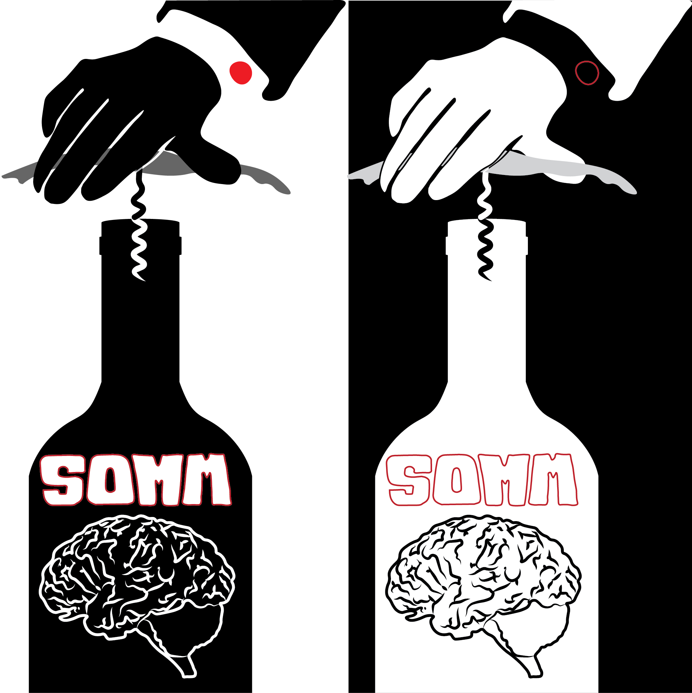

# A Systematically Optimized Miniaturized Mesoscope (SOMM) for large-scale calcium imaging in freely moving mice

Code and meterials for systematically optimized miniaturized mesoscope (SOMM)

    

## 📋 Table of content
 1. [Overview](#Overview)
 2. [DOE optimization](#DOE)
    1. [Prepare environment](#Environment)
    1. [Generate Zernike polynomals](#zernike)
    2. [Generate NAOMi samples](#naomi)
    3. [Run the optimization](#run)
 3. [Mechanical and electrical part details](#Train)
    1. [Realistic widefield capture generation](#single_color)
    2. [Background removal network training](#dual_color)
    3. [Soft PCB design](#soft_pcb)
 4. [Processing code](#processing)
    1. [Deconvolution](#deconv)
    2. [DeepWonder](#deepwonder)
 5. [Contact](#Information)
    1. [Citation](#Citation)
    2. [Email](#Email)

## **📚** Overview 
Interrogating neural circuits in freely behaving mammals is poised to shed a light on the neuronal systems dynamics underlying complex naturalistic behaviors. However, optical recording of neuronal activity in freely behaving animals has remained limited to a small scale and is vulnerable to motion-induced focus drifting. Here, we present a systematically optimized miniaturized mesoscope (SOMM), a widefield, head-mounted fluorescent mesoscope that overcomes these obstacles and allows imaging during free behavior at mesoscopic field-of-view, single-cell resolution, with uniform illumination, and robust axial accessibility. Powered by compact diffractive optics and associated computational algorithms, SOMM can capture neuronal network activity within a field-of-view of 3.6 × 3.6 mm¬2 at 4 µm resolution and at up to 16 Hz in the cortex of freely moving mice, with great defocus tolerance across 300 µm and a weight of less than 2.5 g. Using SOMM, we recorded large-scale population activity during social interactions, cross-region neuronal activity evoked by visual and electrical stimuli, and neurovascular coupling in dual-color, all at single-cell spatial resolution and physiologically relevant temporal resolution 

## **⏳** DOE optimization 
In this part we introduce the DOE optimization in SOMM. 
### **💡** Environment 
* Ubuntu 16.04 
* Python 3.6
* tnesorflow = 1.14
* NVIDIA GPU (24 GB Memory) + CUDA

### **💡** Generate zernike polynomials 
* run DOE_optimization\gen_zernike_polynomial.m to generate Zernike basis for optimization

### **💡** Generate NAOMi samples for training 
* Code for generating NAOMi samples built for one-photon (or widefield) imaging modality can be found in https://github.com/yuanlong-o/Deep_widefield_cal_inferece

### **💡** Run optimization for DOE 
* Run main_LFOV_DOE_train.py to train a DOE and corresponding decovnolution algorithm for large FOV capability and depth robustness. Optical parameters should be corresondingly modified for different systems.
* The output phase would 

## **🔁** Mechanical part details 

### **💡** SOMM 
* The mechanical design for single-color SOMM can be found in Mechanical\SOMM folder. Require Solidworks >= v.2022.

### **💡** Dual-color SOMM 
* The mechanical design for dual-color SOMM can be found in Mechanical\Dual_Color_SOMM folder. Require Solidworks >= v.2022.
 
### **💡** Dual-color SOMM 
* The soft PCB design for dual-color SOMM can be found in TODO folder. Require Solidworks >= v.2022.
 
## 🤝 Processing code 
### **📝** Deconvolution 
* We use L2 regularized deconvolution for each patches. A demo data and demo script can be found in Processing\Deconvolution.

### **📝** DeepWonder 
* We use DeepWonder for extracting neuronal spatial and temporal profiles from deconvolved videos. The full processing code can be found in Processing\DeepWonder. A standalone readme containing environment setup and running instruments can be found in Processing\DeepWonder\readme.md

## 🤝 Contact 
### **📝** Citation 

Yuanlong Zhang*, Lekang Yuan*, Jiamin Wu, Tobias Nöbauer, Rujin Zhang, Guihua Xiao, Mingrui Wang, Hao Xie, Qionghai Dai‡, and Alipasha Vaziri‡, "A Systematically Optimized Miniaturized Mesoscope (SOMM) for large-scale calcium imaging in freely moving mice", bioRxiv 2022.

### **📝** Email 
We are pleased to address any questions regarding the above tools through emails (yuanlongzhang94@gmail.com).
